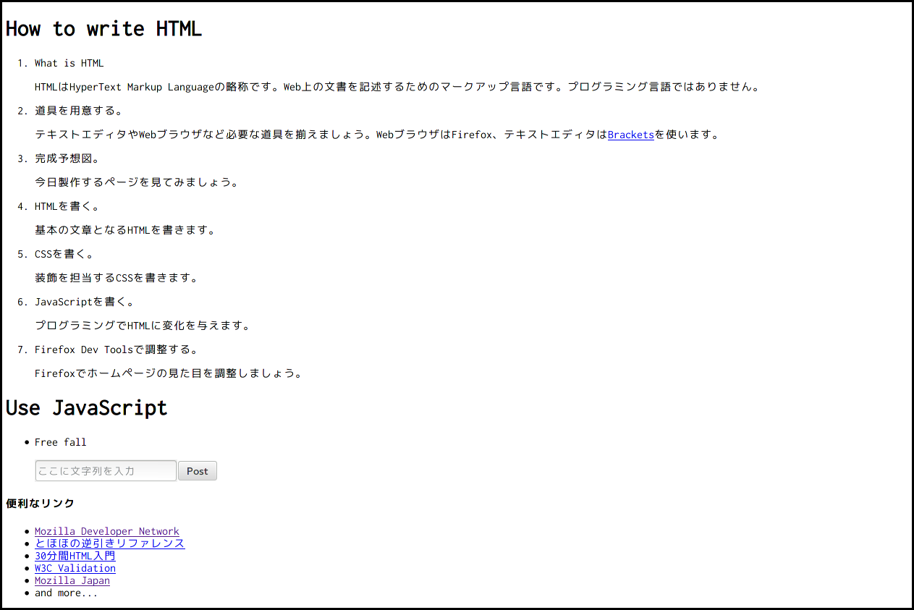
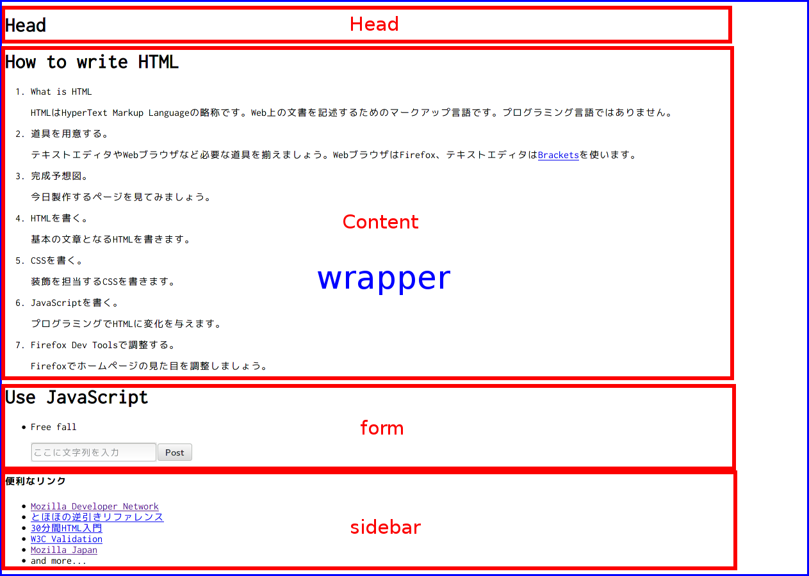
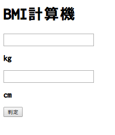

# スマホアプリを作ってみよう！

## はじめに

 今回の勉強会は、自分の力でアプリを書く為の基本的なWebの知識を、実際にHTMLとCSS・JavaScriptを使ってウェブページを書いてもらいながら勉強する事を目的にしています。
 少し簡単過ぎるなぁ、と思う人はどんどん先に進んでもらって構いませんし、自分のペースに合わせて進めて下さい。

## 書く前の準備

 まず、ウェブページを書き始める前にテキストエディタを用意して下さい。テキストエディタとはWindowsのメモ帳のようなテキストを入力、編集するためのソフトウェアです。
テキストエディタには、Brackets, Vim, Emacs, Sublime Text 3, サクラエディタ等色々なものがありますので、自分にあったものを使ってください。特に候補がない場合は今回はSublime Text 3をおすすめします。

## HTMLでウェブページの形を作ろう

 基本的なウェブページはHTML,CSS,JavaScriptの３つから構成され、それぞれ別々の役割があります。
 その中でもHTMLはウェブページの文章、レイアウトの基礎を担当し骨組みを作る役割を持ちます。
 まず初めにHTMLを書いて、ウェブページを形作って行きましょう。

 
 上のテストページはprotoフォルダ内にある、htmlファイル一つだけで出来ています。

 ウェブページで見えているものは、基本的に全て`<hoge>~</hoge>`の様なhtmlファイル上のタグを用いて表されています。
 htmlタグは、`<hoge>~</hoge>`の"hoge"の部分がタグ名となっており、タグ名によって実際にウェブページとしての表現が変わります。
 
 基本的なhtmlタグを以下にまとめましたので、覚えておいて下さい。

 - htmlタグ:囲まれた範囲がhtml文書であることを意味します。
 - headタグ:ホームページのタイトルや、アイコン等の指定が出来ます。このタグ内で他のファイルを呼び出す事も出来ます。
 - bodyタグ:このタグの中の物がウェブページとして表示されます。
 - divタグ:他のタグを中に収納する役割を持つタグ、例外なくほぼ全てのウェブページで使用されます。
 - olタグ:Ordered Listの略で、箇条書きを表す事が出来ます。liタグを使うことで箇条書きにする文章を書くことが出来ます。
 - aタグ:他のウェブページへのリンクを貼る事が出来ます。
 - imgタグ:画像を貼る事が出来ます。
 - h1~h6タグ:見出しを表します。
 - pタグ:段落を表します。

 div要素を用いる事でウェブページの骨組みを作る事が出来ますが、実際に先程のページも以下の様にdivタグで骨組みが作られています。
 
 このテストページでは、左側に表示したい部分をsidebarと言うidでdivタグを用いて表現しています。

 ページのタイトル、本文、コメント欄をdivタグにそれぞれidをhead,content,formとして表現しています。
 sidebarは左側ではなく他のタグと同様に並んでしまっていますが、これは後のcssを用いる事で左側に配置する事が出来ます。

## CSSでウェブページの見た目を変えよう
 CSS, Cascading Style Sheetsはウェブページの色やレイアウトの見た目の部分を担当しています。  
 CSSは、見た目を変更したい要素を指定し、どのように変更するかについて記述することでhtmlに影響を与えます。  
 図示すると以下のようになります。

    変更したい要素{
      なにを変更するか:どのように変更するか;
    }

 変更したい要素を指定し、その要素をどのような見た目にするかを続く{}の中に指定します。  
 変更したい要素のことをセレクタ、なにを変更するかをプロパティ、どのように変更するかを値と呼びます。

    セレクタ{
      プロパティ: 値;
    }

 これだけでは分かりにくいので、実際にさきほど書いたhtmlの見た目をCSSで変更してみましょう。
 下記をstyle.cssに書き込み保存、ブラウザを更新してください。

    body{
      background-color: ivory;
    }

 ウェブページの背景が変わったと思います。このようにCSSは背景色などのウェブページの見た目を変更する役割を持っています。  
 このCSSは下記のようにbodyという要素(セレクタ)の背景色(プロパティ)をアイボリー色(値)にすることを意味しています。
 
    bodyという要素{
      背景色: アイボリー;
    }

 セレクタをどのように指定すればいいのかを説明します。たとえば、\<hoge\>~\</hoge\>で囲まれた部分を変更したい時は**hoge**と書きます。 
 ここではbodyタグで囲まれていた場所を変更するのでセレクタはbodyになります。
 また、さきほど出てきたidという指定も役に立ちます。id＝"sidebar"と指定した要素は**#sidebar**で指定することができます。   
 style.cssを参考にウェブページに見た目を追加していってみましょう。style.cssの末尾にプロパティの説明があります。  
 cssを書いていき、わからないところがあれば逐一聞いてください。

 ウェブページの背景が変わったと思います。このようにCSSは背景などのウェブページの見た目を変更する役割を持っています。
 上記のコードでは、bodyという要素(変更したい要素)の背景(なにを変更するか)をダークブルーとスカイブルーのグラデーション(どのように変更するか)に指定しています。
 変更したい要素をどのように指定すればいいのかを説明します。たとえば、`<hoge>~</hoge>`で囲まれた部分を修正したい時は**hoge**と書きます。
 また、さきほど出てきたidという指定も役に立ちます。id＝"sidebar"と指定した要素は**#sidebar**で指定することができます。
 style.cssを参考にウェブページに見た目を追加していってみましょう。

## javascriptでウェブページを自由に操作しよう

html,CSSだけでも綺麗なウェブページを作る事が出来ますが、javascriptを用いる事でより面白いページを作る事が出来ます。
javascriptはプログラム言語の一つですが、難しい知識無しでもhtmlタグを使ったプログラミングをする事が出来ます。

試しに、入力された文字をアラート(エラーの時等に出るやつです)に表示するスクリプトを書いて、大まかに書いてみましょう。

javascriptでコンテナに服をしまうように一時的にデータを保管しておきたい時は、変数を使います。
変数は以下の様に書くことが出来ます。

    var 変数名 = 変数に入れるデータ;

ここで、入力された文章を一度変数に入れて、その後アラートととして表示する事を考えてみます。
まず、文章を取得するには以下の様にします。

    document.getElementsByName("input-form")[0].value;

この命令を大まかに説明すると、htmlドキュメントの中にある"input-form"と言う名前のものの中身を取り出すと言う事になります。もし、詳しい説明が欲しければ言って下さい。

これを変数の中に入れるには、以下のようにします。

    var text = document.getElementsByName("input-form")[0].value;

これで、textという変数に入力されたテキストが入りましたので、以下のようにしてアラートを表示させます。

    alert(text);

ここまでコードがかけたらウェブページを再度読み込んで、Postボタンを押してみて下さい。

## ウェブページをアプリにしてみよう

ここまで学んだHTML,CSS,JavaScriptの知識を使って、アプリを作ってみましょう。

上のページがそのままアプリ画面となります。

HTML,CSS,JavaScriptを用いたアプリは、Bmiappフォルダのように以下のファイルから作られます。

- HTMLファイル(index.html)
- CSSファイル(app.css)
- JavaScriptファイル(app.js)
- アイコンファイル(icon_128.png)
- マニフェストファイル(manifest.webapp)

HTMLファイル・CSSファイル・JavaScriptファイルについてはウェブページと同じなので割愛しますが、このウェブページをアプリにする為にはアイコンファイル・マニフェストファイルが必要になります。

マニフェストファイルはjsonというデータ記述言語で書かれておりますが、[Manifest Maker](whitehawk-taka.tumblr.com/manifestmaker)を用いることで簡単に作成出来ます。
